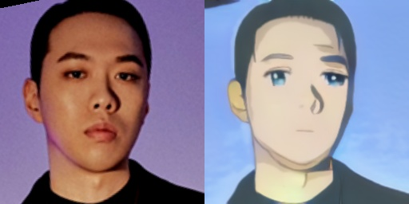

## UGATIT_selfie2anime

본 repository에서는 [UGATIT 논문](https://github.com/taki0112/UGATIT) 에서 제공한 기본 UGATIT을 적용하여 pretrained된 weight를 이용해서 facial image를 anime image로 쉽게 변화할 수 있도록 수정한 [github 게시물](https://github.com/kairess/ugatit)을 가지고 와서 다양한 이미지들에 적용해 보았다.


### 1. Tensorflow 설치하기
- TensorFlow 1.13+
- ```pip3 install tensorflow==1.8```

Tensorflow를 설치할 때, 2.0 버전 이상에서는 코드가 동작하지 않는다.
이는 코드에서 deprecated된 함수를 repository에서 사용하고 있기 때문이다.
구현할 때, 본인은 1.80버전의 tensorflow를 설치했고, 이를 위해서 python 3.6.5버전을 설치했다.
3.8.5최신 버전의 python 사용시, tensorflow 버전이 2.0이상만 설치 가능한 것으로 확인했다.

### 2. Requirements
- ```pip3 install opencv-python```
- ```pip3 install dlib```
- ```pip3 install matplotlib```
- ```pip3 install numpy```
- ```pip3 install glob```
- ```pip3 install jupyter```

위 항목들이 설치가 필요한 라이브러리들이다.
dlib의 경우 cmake를 받아놓은 상태가 아니면 설치가 되지 않으니, cmake 부터 설치하여야 한다.

- ```pip3 install cmake```

### 3. Pre-trained weight 적용하기

본인은 UGATIT 논문에서 주어진 100 epoch trained model을 사용했다. [Trained Model](https://drive.google.com/file/d/19xQK2onIy-3S5W5K-XIh85pAg_RNvBVf/view) 을 다운로드 받고, 압축을 풀어 다음과 같은 경로에 파일들이 오게 설정해주면 된다.

```
├── UGATIT
   └── checkpoint
       ├── UGATIT_selfie2anime_lsgan_4resblock_6dis_1_1_10_10_1000_sn_smoothing
           ├── checkpoint
           ├── UGATIT.model-1000000.data-00000-of-00001
           ├── UGATIT.model-1000000.index
           └── UGATIT.model-1000000.meta
```

단, UGATIT.model-1000000.data-00000-of-00001 파일의 사이즈를 주목해서 7~8GB 정도가 되지 않는다면, 이는 압축해제 과정에서 데이터가 유실된 것이다. 다른 방법들을 이용해 압축을 풀 것을 권장한다.





### 4. test.ipynb 실행하기
```jupyter notebook``` 으로 jupyter notebook을 실행 한 뒤, test.ipynb 파일을 열어 실행한다.

초기 부분에 작성된 코드는 openCV를 이용해 이미지를 읽어들이고, 대비를 바꾸고, aligment를 조정하는 등의 작업을 진행하는 부분이다.

Test 탭에 있는 이미지의 이름만 바꾸어주면 원하는 이미지의 변환을 진행할 수 있다. imgs 디렉토리 내에 있는 모든 파일들을 변환할 수도 있다.

---
<div align="center">
  
</div>

### [Paper](https://arxiv.org/abs/1907.10830) | [Official Pytorch code](https://github.com/znxlwm/UGATIT-pytorch)
This repository provides the **official Tensorflow implementation** of the following paper:

> **U-GAT-IT: Unsupervised Generative Attentional Networks with Adaptive Layer-Instance Normalization for Image-to-Image Translation**<br>
> **Junho Kim (NCSOFT)**, Minjae Kim (NCSOFT), Hyeonwoo Kang (NCSOFT), Kwanghee Lee (Boeing Korea)
>
> **Abstract** *We propose a novel method for unsupervised image-to-image translation, which incorporates a new attention module and a new learnable normalization function in an end-to-end manner. The attention module guides our model to focus on more important regions distinguishing between source and target domains based on the attention map obtained by the auxiliary classifier. Unlike previous attention-based methods which cannot handle the geometric changes between domains, our model can translate both images requiring holistic changes and images requiring large shape changes. Moreover, our new AdaLIN (Adaptive Layer-Instance Normalization) function helps our attention-guided model to flexibly control the amount of change in shape and texture by learned parameters depending on datasets. Experimental results show the superiority of the proposed method compared to the existing state-of-the-art models with a fixed network architecture and hyper-parameters.*


## Citation
If you find this code useful for your research, please cite our paper:

```
@inproceedings{
Kim2020U-GAT-IT:,
title={U-GAT-IT: Unsupervised Generative Attentional Networks with Adaptive Layer-Instance Normalization for Image-to-Image Translation},
author={Junho Kim and Minjae Kim and Hyeonwoo Kang and Kwang Hee Lee},
booktitle={International Conference on Learning Representations},
year={2020},
url={https://openreview.net/forum?id=BJlZ5ySKPH}
}
```

## Author
[Junho Kim](http://bit.ly/jhkim_ai), Minjae Kim, Hyeonwoo Kang, Kwanghee Lee
